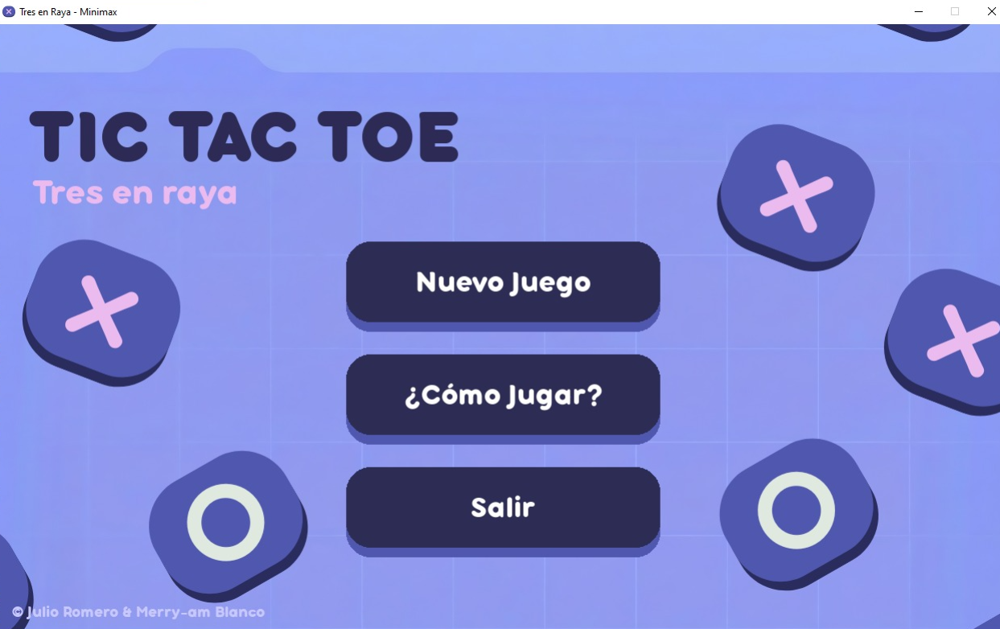
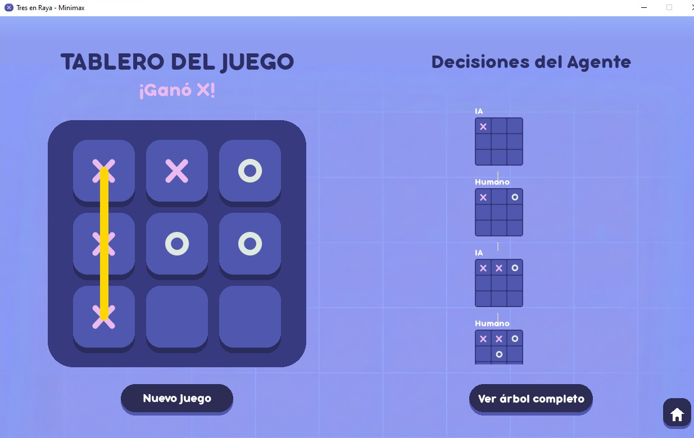
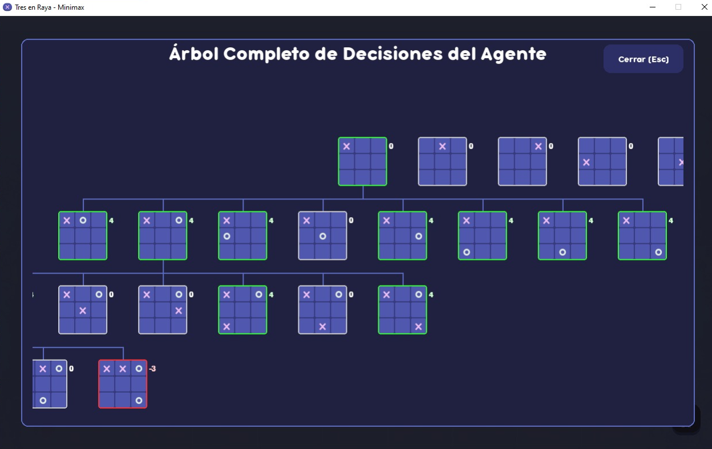

# 🧠 Tres en Raya (Tic-Tac-Toe) con Agente Minimax


> **TRES EN RAYAS:** Enfréntate a una Inteligencia Artificial invencible y visualiza en tiempo real cómo "piensa" y toma sus decisiones.

---

## 📸 Galería

| Menú Principal | Tablero de Juego |
|:---:|:---:|
|  |  |

| Árbol de Decisiones | Pantalla de Ayuda |
|:---:|:---:|
|  |  |

---

## ✨ Características Principales

### 🤖 Agente de Inteligencia Artificial
*   Implementación del algoritmo **Minimax**.
*   La IA juega de forma óptima: siempre buscará ganar o, en el peor de los casos, forzar un empate. ¡Intenta ganarle si puedes!
*   **Métricas en Consola:** Visualiza el tiempo exacto de cómputo por jugada.

### 🎨 Interfaz Gráfica 
*   Diseño estilo *cartoon* con colores modernos (paleta morada/azul).
*   **Botones interactivos:** Efectos de elevación, sombras y sonidos al pasar el mouse.
*   **Feedback visual:** Animaciones al colocar fichas y línea dorada al ganar.

### 🌳 Visualización de Datos
*   **Panel Lateral:** Observa el "camino real" que ha tomado la partida paso a paso.
*   **Explorador de Árbol (Modal):** Una ventana interactiva que despliega el árbol de estados completo generado por la IA, permitiéndote navegar por los posibles futuros del juego.

---

## 🚀 Instalación y Ejecución

Sigue estos pasos para probar el proyecto en tu máquina local:

1.  **Clonar el repositorio:**
    ``` bash
    git clone https://github.com/merychi/agente-tres-rayas
    cd agente-tres-rayas
    ```

2.  **Crear un entorno virtual (Opcional pero recomendado):**
    ``` bash
    python -m venv venv
    source venv/bin/activate  # En Windows: venv\Scripts\activate
    ```

3.  **Instalar dependencias:**
    Solo necesitas `pygame`.
    ``` bash
    pip install pygame
    ```

4.  **¡Jugar!**
    ```
    python main.py
    ```
---

## 📂 Estructura del Proyecto

El código está modularizado para mantener el orden y la escalabilidad:

```text
agente-tres-rayas/
├── 📂 assets/          # Imágenes, fuentes (.ttf) y sonidos (.wav/.mp3)
├── 📂 game/            # Lógica del núcleo
│   ├── ai.py           # Algoritmo Minimax y generación de árboles
│   └── logic.py        # Reglas del Tres en Raya
├── 📂 ui/              # Interfaz de Usuario
│   ├── config.py       # Colores y constantes
│   ├── components.py   # Elementos reutilizables (mini tableros, botones)
│   ├── interface.py    # Pantalla principal del juego
│   ├── menu.py         # Menú principal animado
│   ├── help.py         # Pantalla de "Cómo jugar"
│   └── events.py       # Manejo de inputs del usuario
└── main.py             # Punto de entrada y bucle del juego
```

## 🧠 ¿Cómo funciona el algoritmo?

1. Este proyecto utiliza Minimax, un algoritmo recursivo utilizado en teoría de juegos para minimizar la posible pérdida máxima.
2. La IA genera un árbol con todos los movimientos futuros posibles.
3. Asigna un puntaje a los estados finales (+10 si gana la IA, -10 si gana el humano, 0 empate).
4. Propaga estos valores hacia arriba:
5. En su turno, elige el valor MÁXIMO.
6. En el turno del oponente, asume que este jugará lo mejor posible (valor MÍNIMO).


## 👥 Créditos
Desarrollado por:
- [Merry-am Blanco](https://github.com/merychi)
- [Julio Romero](https://github.com/Jumicode)